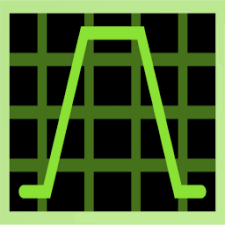

<!-- PROJECT LOGO -->
 

  
  
  <h3 align="center">Welcome to Verilog coding</h3>

  

   A complete verilog guide to start your journey in frontend VLSI design
     
    <a href="https://github.com/othneildrew/Best-README-Template/issues/new?labels=bug&template=bug-report---.md">Report Bug</a>
    ·
    <a href="https://github.com/othneildrew/Best-README-Template/issues/new?labels=enhancement&template=feature-request---.md">Request Feature</a>
  

<!-- TABLE OF CONTENTS -->
## DOCUMENTATION

Welcome to the documentation for Verilog coding of Combinational circuits! This guide will help you understand and navigate the resources available for this project. Whether you're a developer, user, or contributor, this documentation is designed to provide you with the information you need to get started, use the software effectively, and contribute to its development.
  

  
Table of Contents

  <ol>
    <li>
      <a href="#introduction">Introduction</a>
      <ul>
        <li><a href="#what-is-a-combinational-circuit-?">What is a combinational circuit ?</a></li>
      </ul>
      <ul>
        <li><a href="#repository-structure">Repository Structure</a></li>
      </ul>
      <ul>
        <li><a href="#built-with">Built with</a></li>
      </ul>
    </li>
    <li>
      <a href="#getting-started">Getting Started</a>
      <ul>
        <li><a href="#prerequisites">Prerequisites</a></li>
        <li><a href="#installation">Installation</a></li>
      </ul>
    </li>
    <li><a href="#usage">Usage</a></li>
    <li><a href="#roadmap">Roadmap</a></li>
    <li><a href="#contributing">Contributing</a></li>
    <li><a href="#license">License</a></li>
    <li><a href="#contact">Contact</a></li>
    <li><a href="#acknowledgments">Acknowledgments</a></li>
  </ol>

<!-- ABOUT THE PROJECT -->
## INTRODUCTION

👋 Welcome to the Verilog HDL Programming Repository! This repository is designed to assist individuals who are either new to Verilog or looking to refresh their knowledge of digital electronic circuits using Verilog. It aims to provide a collection of examples focused on combinational circuits to help you learn and master Verilog HDL (Hardware Description Language).

 

### What is a Combinational Circuit?

Combinational circuits are digital circuits where the output is solely determined by the current inputs, with no memory elements involved. These circuits do not store any past information, and their output is a function of only the present input values. Examples include adders, multiplexers, and logic gates.

### Repository Structure
This repository contains:

  * Module Code: Verilog HDL code for various combinational circuits.

  * Testbench: Testbench files for verifying the functionality of each module.

  * Schematic: Visual representation of the circuit design.

  * Simulation Waveform: Simulation results demonstrating the circuit's behavior.

 

Each design example in this repository is provided with these four components to give you a comprehensive understanding of how to create and test digital circuits in Verilog.

Feel free to explore the code, use it as a learning tool, and contribute improvements. Happy coding! :smile: 

### Built With 🔧

 

Xilinx Vivado 2020.2

 

Icarus verilog

  

 

Gtkwave

 

VS Code

<!-- GETTING STARTED -->
## Getting Started

This guide will help you get up and running with the Verilog code in this repository. Whether you’re a professional or just starting out, you’ll find everything you need to start exploring and utilizing these Verilog modules.

### Prerequisites
Before you get started, make sure you have the following tools installed:

Verilog Simulator: You'll need a Verilog simulator to compile and test the code. Some popular options include:

* Vivado Simulator
* Icarus Verilog
  
Synthesis Tool: To synthesize the Verilog code for FPGA implementation, you’ll need a synthesis tool such as:

* Xilinx Vivado
* Xilinx ISE
  
Basic Knowledge: Familiarity with Verilog HDL and FPGA design concepts is helpful, a very thorough understanding of digital electronic circuits. THis repository mainly focuses on combinational circuits. So, you need to have the basic knowledge of adders, subtractors, multiplexers, decoders, encoders, multipliers, comparators and code convertors.

### Installation

1. Xilinx Vivado at [AMD](https://www.amd.com/en.html)
2. Icarus verilog at [Icarus](https://bleyer.org/icarus/)
3. VS code at [VS code](https://code.visualstudio.com/Download)

### Cloning the Repository
To get a local copy of this repository, use the following command:
`git clone https://github.com/yourusername/your-repository-name.git`
Replace yourusername and your-repository-name with the appropriate values.

### Directory Structure

After cloning the repository, you’ll find the following directory structure:

your-repository-name/  
│   
├── src/              # Source code directory   
│   ├── module1.v     # Example Verilog module    
│   ├── module2.v     # Another Verilog module   
│   └── ...           # Additional Verilog files   
│   
├── test/             # Testbenches directory   
│   ├── module1_tb.v  # Testbench for module1   
│   ├── module2_tb.v  # Testbench for module2   
│   └── ...           # Additional testbenches   
│   

